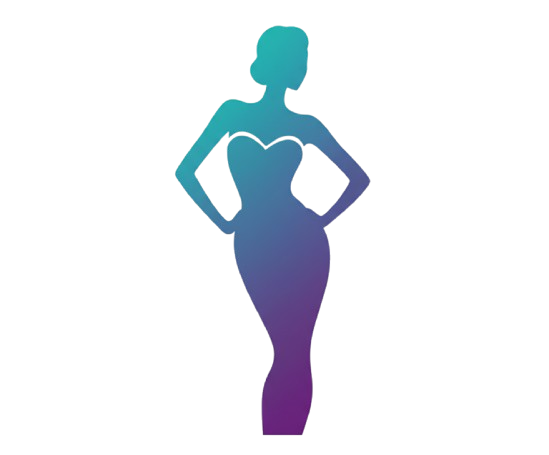

# 👗 LOOKBOOKgen - AI Fashion Content Generator



> **LOOKBOOKgen** - Humanizing Generative AI for Fashion

**LOOKBOOKgen** is a revolutionary web platform designed for fashion brands, designers, and e-commerce businesses. Our mission is to reduce clothing waste by enabling market research before mass production. Upload real model photos to create AI-powered avatars, test designs with virtual lookbooks, and produce only what sells.

---

## 🌟 Key Mission

### REDUCING CLOTHING WASTE, NOT JOBS
### SLOW FASHION ABOVE FAST FASHION

We empower the fashion industry to test designs before committing to mass production. By creating AI lookbooks from real model photos and physical samples, brands can:
- Validate market demand before manufacturing
- Reduce overproduction and fashion waste
- Make data-driven production decisions
- Support real models, photographers, and designers

---

## 🚀 Features

### 🎨 Interactive Landing Page
- **Aurora Canvas Animation** - Interactive background that responds to mouse movement
- **Animated Hero Section** - Smooth transitions and typewriter effects
- **Before/After Showcase** - Compare real model photos with AI avatar results
- **Workflow Visualization** - 6-step process from photoshoot to social media
- **Infinite Fashion Carousel** - Seamless looping carousel showcasing fashion styles

### 📊 Problem-Solution Framework
- **Overproduction Awareness** - Visual representation of fashion industry waste
- **Market Validation Solution** - Test with one sample instead of producing hundreds
- **Real People, Real Process** - Behind-the-scenes imagery showing collaboration

### 🎯 All-in-One Creative Tool
- **Packshot Collections** - Transform existing clothes into stunning visuals
- **Social Media Integration** - One-click export to social platforms
- **B2B Ready** - Enterprise integration capabilities
- **Endless Content Generation** - Create unlimited variations for campaigns

### 🎪 Gallery Showcase
- 8-image interactive gallery with hover effects
- AI-generated fashion content examples
- Multiple style categories (Street Style, Evening Glam, Editorial Fashion, etc.)

---

## 💻 Tech Stack

- **Framework:** Next.js 13+ (React)
- **Animations:** Framer Motion
- **Styling:** CSS Modules with custom animations
- **Interactive Elements:** Canvas API for aurora effects
- **Typography Animation:** react-type-animation
- **Deployment Ready:** Vercel-optimized

---

---

## 🛠️ Installation & Setup

### Prerequisites
Before you begin, ensure you have the following installed:
- **Node.js** (v16.x or higher) - [Download here](https://nodejs.org/)
- **npm** (comes with Node.js) or **yarn**
- **Git** - [Download here](https://git-scm.com/)

### Step 1: Clone the Repository
```bash
git clone https://github.com/rahulkannan08/lookwand.git
cd lookwand
```

### Step 2: Install Dependencies
```bash
npm install
# or if you prefer yarn
yarn install
```

This will install all required packages including:
- next
- react
- react-dom
- framer-motion
- react-type-animation

### Step 3: Run the Development Server
```bash
npm run dev
# or
yarn dev
```

The application will start on **http://localhost:3000**

### Step 4: Build for Production
```bash
npm run build
npm start
# or
yarn build
yarn start
```

### Step 5: Deploy to Vercel (Recommended)
```bash
# Install Vercel CLI
npm i -g vercel

# Deploy
vercel
```

Or connect your GitHub repository directly to Vercel for automatic deployments.

---

## 📱 How to Use LOOKBOOKgen

1. **Landing Page Experience**
   - Move your mouse across the screen to interact with the aurora animation
   - Watch the typewriter animation showcase different use cases
   - Scroll through the workflow steps to understand the process

2. **Explore Fashion Styles**
   - Browse the infinite carousel showing various fashion categories
   - Hover over images for interactive effects

3. **Understand the Mission**
   - Learn about fashion industry overproduction waste
   - See the problem-solution framework
   - View real behind-the-scenes collaboration images

4. **View AI Gallery**
   - Explore 8 example images showing AI-generated fashion content
   - See different styles from casual to editorial fashion

5. **Create AI Lookbook**
   - Click "CREATE AI LOOKBOOK" button to access the lookbook creator
   - Upload photos and browse the catalog

---


## 📂 Project Structure

```
lookwand/
├── components/
│   └── DressViewer3D.js           # 3D product rotation viewer component
├── pages/
│   ├── _app.js                    # Next.js app wrapper & global config
│   ├── index.js                   # Landing page (hero, mission, animations)
│   ├── lookbook.js                # Lookbook creator page
│   └── catalog.js                 # Product catalog with filters
├── public/
│   └── images/                    # All image assets
│       ├── logo.png               # LOOKBOOKgen logo
│       ├── model-*.jpg            # Model showcase images
│       ├── overproduction-waste.png
│       └── [fashion images]       # Gallery and carousel images
├── styles/
│   └── globals.css                # Global styles & custom animations
├── package.json                   # Dependencies & scripts
├── vercel.json                    # Vercel deployment configuration
├── copy-suggestions.md            # Copy suggestions for the website
└── README.md                      # This file

```

---

## 🎨 Key Components

### Aurora Canvas Animation
- Interactive background using HTML5 Canvas API
- 6 layers of flowing aurora effects
- Mouse-responsive animations with ripple effects
- Frozen state when mouse is inactive
- Smooth gradient transitions

### Fashion Carousel
- Infinite loop carousel (8 items: 4 original + 4 duplicates)
- No empty spaces - seamless continuous scrolling
- Hover effects with scale and elevation
- Image overlays with labels and descriptions

### Hero Showcase
- Before/After comparison cards
- 3D rotation effects on hover
- Floating badges (REAL/AI indicators)
- Corner decorations and glow effects
- Connecting arrow animation

### Mission Section
- Problem-solution grid layout
- SVG icons for visual representation
- Animated on scroll (Framer Motion)
- Behind-the-scenes image gallery

---

## 🔧 Customization

### Adding New Images
1. Place images in `/public/images/` directory
2. Update the image arrays in `pages/index.js`:
   - Carousel images (line ~450)
   - Gallery images (line ~750)

### Modifying Animations
- Aurora effects: `pages/index.js` (AuroraLayer class, line ~40-150)
- Framer Motion animations: Check `initial`, `animate`, `whileHover` props
- CSS animations: `styles/globals.css`

### Changing Colors
- Primary cyan: `#3be3ff` / `rgb(96, 239, 255)`
- Update in `globals.css` and inline styles

### Text Content
- All text content is in `pages/index.js`
- Copy suggestions available in `copy-suggestions.md`

---

## 🚀 Performance Optimizations

- **Image Optimization:** Use Next.js Image component for production
- **Code Splitting:** Automatic with Next.js
- **Animation Performance:** CSS transforms and opacity for smooth 60fps
- **Canvas Rendering:** Optimized with requestAnimationFrame
- **Lazy Loading:** Viewport-based animation triggers with Framer Motion

---

## 🌐 Browser Support

- Chrome (latest)
- Firefox (latest)
- Safari (latest)
- Edge (latest)
- Mobile browsers (iOS Safari, Chrome Mobile)

---

## 📝 Available Scripts

```bash
# Development
npm run dev          # Start development server (localhost:3000)

# Production
npm run build        # Build for production
npm start            # Start production server

# Linting
npm run lint         # Run ESLint

```

---

## 🤝 Contributing

We welcome contributions! Here's how you can help:

1. Fork the repository
2. Create a feature branch (`git checkout -b feature/AmazingFeature`)
3. Commit your changes (`git commit -m 'Add some AmazingFeature'`)
4. Push to the branch (`git push origin feature/AmazingFeature`)
5. Open a Pull Request

---

## 📄 License

This project is open source and available under the MIT License.

---

## 👥 Team

- **Project Lead:** Rahul Kannan
- **Repository:** [github.com/rahulkannan08/lookwand](https://github.com/rahulkannan08/lookwand)

---

## 📞 Contact & Support

- **GitHub Issues:** [Report bugs or request features](https://github.com/rahulkannan08/lookwand/issues)
- **Website:** Visit the live demo (deploy on Vercel)

---

## 🎯 Roadmap

- [ ] Backend integration for real AI avatar generation
- [ ] User authentication and profile management
- [ ] Real-time image upload and processing
- [ ] Social media API integration
- [ ] E-commerce platform connectors
- [ ] Analytics dashboard for market feedback
- [ ] Mobile app version

---

## 💡 Philosophy

**Fashion Needs The Human Touch**

We don't replace models, stylists, or photographers. We empower them. Real models are hired. Real clothes are made. Real creativity drives everything. AI is just a tool for market research - helping brands make smarter decisions and reduce waste, not jobs.

---

**Made with ❤️ using Next.js and React**

*Reducing fashion waste, one lookbook at a time.*
